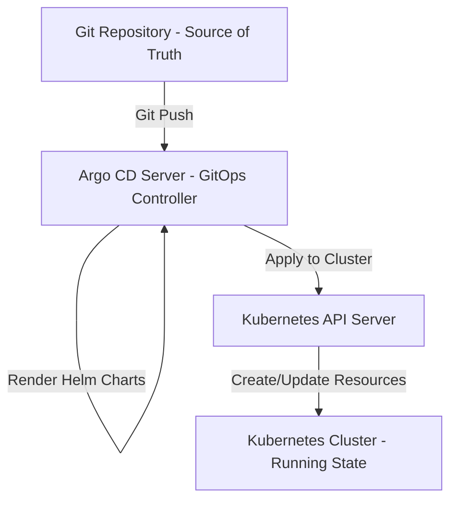
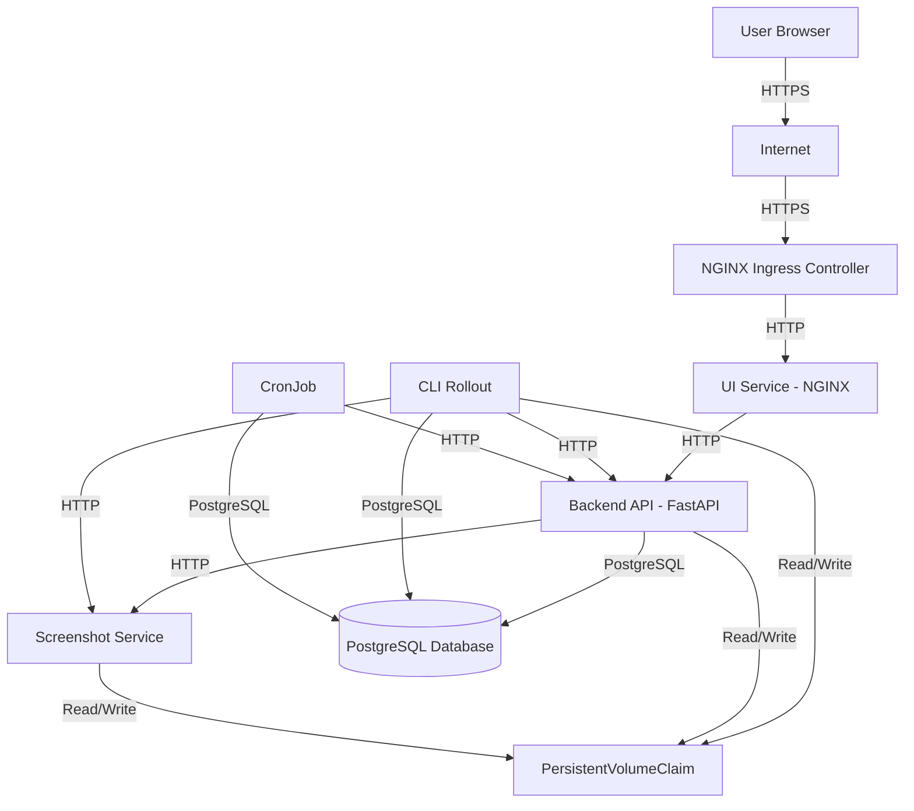
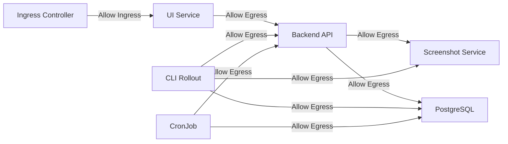
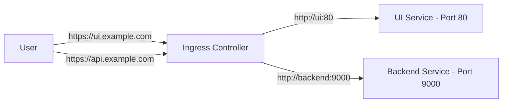

# Helm Charts Repository

## Overview

This repository provides production-ready Helm charts for deploying enterprise-grade applications on Kubernetes. Charts are designed for GitOps workflows, security-first operations, and operational excellence at scale.

### Purpose

The repository serves as the centralized source of truth for Kubernetes application deployments. All charts are production-validated, security-hardened, and designed for automated deployment via Argo CD.

### Intended Audience

- Platform engineers and SRE teams managing Kubernetes infrastructure
- DevOps engineers implementing GitOps workflows
- Security teams reviewing deployment configurations
- Architects designing multi-service application deployments

### Scope

This repository includes:
- Production-ready Helm charts with secure defaults
- GitOps-compatible configurations for Argo CD
- Network isolation and security policies
- Operational best practices and documentation

### Non-Goals

- Development environment quick-start guides
- Tutorial content for Kubernetes beginners
- Non-production deployment patterns
- Experimental or alpha features

## Design Principles

### GitOps-First

All charts are designed for declarative GitOps workflows. The desired state is defined in Git and automatically synchronized to clusters via Argo CD. Manual `kubectl` operations are discouraged in production.

### Secure by Default

Charts implement security best practices by default:
- Least-privilege ServiceAccounts with explicit RBAC
- NetworkPolicies restricting pod-to-pod communication
- Pod security contexts preventing privilege escalation
- Secrets management via Kubernetes Secrets (never in values.yaml)
- Image pull policies enforcing image verification

### Consistency and Standardization

All charts follow consistent patterns:
- Standardized resource naming via Helm helpers
- Uniform labeling and annotation schemes
- Consistent configuration structure across charts
- Predictable resource organization

### Operational Clarity

Charts expose operational concerns explicitly:
- Health checks configured for all services
- Resource limits and requests defined
- Horizontal Pod Autoscaling (HPA) support
- Pod Disruption Budgets (PDB) for availability
- Structured logging and observability endpoints

### Architectural Transparency

Charts document architectural decisions:
- Service dependencies and communication patterns
- Network topology and ingress paths
- Storage requirements and data persistence
- External dependencies and integration points

## Repository Structure

```
.
├── charts/
│   ├── amazon-watcher-stack/
│   │   ├── Chart.yaml
│   │   ├── values.yaml
│   │   └── templates/
│   │       ├── _helpers.tpl
│   │       └── [resource templates]
│   └── zabbix/
│       ├── Chart.yaml
│       ├── values.yaml
│       └── templates/
│           └── [resource templates]
├── docs/
│   ├── [deployment scripts and documentation]
└── README.md
```

### Chart Structure Expectations

Each chart must include:
- `Chart.yaml`: Chart metadata, version, and dependencies
- `values.yaml`: Comprehensive default values with documentation
- `templates/`: Kubernetes resource templates
- `templates/_helpers.tpl`: Reusable template functions
- `templates/NOTES.txt`: Post-installation instructions (optional)

### Documentation Requirements

Per-chart documentation should cover:
- Architecture and component relationships
- Configuration reference for all values
- Security considerations and RBAC requirements
- Network policies and communication patterns
- Storage requirements and data persistence
- Upgrade and migration procedures

## Available Helm Charts

| Chart Name | Description | Kubernetes Versions | Key Features | Security Posture | Production Readiness |
|------------|-------------|---------------------|--------------|------------------|---------------------|
| `amazon-watcher-stack` | Multi-service application stack for Amazon product monitoring with backend API, web UI, screenshot service, and PostgreSQL database | 1.24+ | Argo Rollouts, HPA, NetworkPolicies, Pod Disruption Budgets, Istio integration, persistent storage | ServiceAccount with RBAC, NetworkPolicies, Pod security contexts, secrets management | Production-ready |
| `zabbix` | Zabbix monitoring solution with server, web UI, and MariaDB database | 1.24+ | Persistent storage, RBAC, configurable resources, health checks | ServiceAccount with RBAC, secrets management | Production-ready |

### Chart Details

#### amazon-watcher-stack

**Architecture**: Microservices-based application with four primary components:
- Backend API: FastAPI/Uvicorn RESTful service
- Web UI: React frontend served via NGINX
- Screenshot Service: Headless browser service using Playwright/Chromium
- PostgreSQL Database: Stateful database for application data

**Key Features**:
- Argo Rollouts for advanced deployment strategies (canary, blue-green)
- Horizontal Pod Autoscaling (HPA) for all services
- NetworkPolicies for pod-to-pod communication restrictions
- Pod Disruption Budgets for high availability
- Optional Istio service mesh integration (VirtualService, DestinationRule, Telemetry)
- Persistent storage with configurable storage classes
- Ingress support with TLS termination

**Security Features**:
- Dedicated ServiceAccount per component
- RBAC for JWT secret generation (least-privilege)
- NetworkPolicies restricting ingress/egress traffic
- Pod security contexts preventing privilege escalation
- Secrets stored in Kubernetes Secrets
- Optional Istio mTLS for service-to-service communication

#### zabbix

**Architecture**: Monitoring stack with three components:
- Zabbix Server: Core monitoring engine
- Zabbix UI: Web-based management interface
- MariaDB: Database backend

**Key Features**:
- Persistent storage for database and configuration
- Configurable resource limits and requests
- Health checks for all components
- RBAC for service account permissions

**Security Features**:
- ServiceAccount with explicit RBAC
- Secrets management for database credentials
- Pod security contexts

## Architecture Overview

### Helm, Kubernetes, and Argo CD Interaction



### Deployment Lifecycle

1. **Git Commit**: Changes committed to Git repository
2. **Argo CD Detection**: Argo CD detects changes via webhook or polling
3. **Helm Rendering**: Argo CD renders Helm templates with values
4. **Diff Calculation**: Argo CD compares desired state (Git) with live state (cluster)
5. **Sync Operation**: Argo CD applies changes to cluster via Kubernetes API
6. **Resource Creation**: Kubernetes controllers create/update resources
7. **Health Monitoring**: Argo CD monitors resource health and reports status

### Assumptions

- Kubernetes cluster version 1.24 or higher
- Argo CD installed and configured in the cluster
- Metrics Server installed for HPA functionality
- Storage classes configured for persistent volumes
- Ingress controller installed (if Ingress resources are used)
- NetworkPolicies supported by CNI (if NetworkPolicies are enabled)
- Service mesh installed (if Istio resources are used)

### Constraints

- Charts assume cluster-admin or equivalent permissions for initial Argo CD setup
- NetworkPolicies require CNI support (may not work in all environments)
- Persistent storage requires appropriate StorageClass configuration
- Argo Rollouts requires CRD installation
- Istio resources require Istio service mesh installation

## Network Architecture & Diagrams

### Service Communication Flow



### Network Policy Boundaries



### Network Policy Rules

**UI NetworkPolicy**:
- Ingress: Allow from Ingress controller namespace
- Egress: Allow to Backend service, DNS, and external HTTPS

**Backend NetworkPolicy**:
- Ingress: Allow from UI pods, Ingress controller namespace
- Egress: Allow to Screenshot service, Database service, DNS, and external HTTPS

**Screenshot NetworkPolicy**:
- Ingress: Allow from Backend pods, CLI pods
- Egress: Allow to external HTTPS (for web scraping), DNS

**Database NetworkPolicy**:
- Ingress: Allow from Backend pods, CLI pods, CronJob pods
- Egress: Allow DNS only

**CLI NetworkPolicy**:
- Ingress: None (no incoming traffic)
- Egress: Allow to Backend service, Screenshot service, Database service, DNS

### Ingress Paths



## Installation with Helm

### Prerequisites

- Kubernetes cluster (version 1.24 or higher)
- Helm 3.x installed
- `kubectl` configured with cluster access
- Appropriate RBAC permissions for target namespace
- Storage class configured (for charts requiring persistent storage)
- Metrics Server installed (for HPA functionality)

### Add Repository

```bash
helm repo add maborak-helm https://charts.maborak.com
helm repo update
```

### Install Chart

**Basic Installation**:

```bash
helm install <release-name> maborak-helm/amazon-watcher-stack \
  --namespace <namespace> \
  --create-namespace
```

**Installation with Custom Values**:

```bash
helm install <release-name> maborak-helm/amazon-watcher-stack \
  --namespace <namespace> \
  --create-namespace \
  -f values-production.yaml
```

**Installation with Value Overrides**:

```bash
helm install <release-name> maborak-helm/amazon-watcher-stack \
  --namespace <namespace> \
  --create-namespace \
  --set ingress.enabled=true \
  --set ingress.className=nginx \
  --set backend.replicas=3
```

### Upgrade Chart

```bash
helm upgrade <release-name> maborak-helm/amazon-watcher-stack \
  --namespace <namespace> \
  -f values-production.yaml
```

### Uninstall Chart

```bash
helm uninstall <release-name> --namespace <namespace>
```

**Note**: Uninstalling a chart does not automatically delete PersistentVolumeClaims. Manually delete PVCs if data cleanup is required:

```bash
kubectl delete pvc -l app.kubernetes.io/instance=<release-name> -n <namespace>
```

### Versioning and Rollback

**View Release History**:

```bash
helm history <release-name> --namespace <namespace>
```

**Rollback to Previous Version**:

```bash
helm rollback <release-name> <revision-number> --namespace <namespace>
```

**Rollback to Last Version**:

```bash
helm rollback <release-name> --namespace <namespace>
```

## GitOps Deployment with Argo CD

### GitOps Principles

GitOps is an operational framework that takes DevOps best practices used for application development and applies them to infrastructure automation. Key principles:

- **Declarative**: The entire system is described declaratively
- **Versioned**: The desired state is versioned in Git
- **Automated**: Changes are automatically applied to the system
- **Continuously Reconciled**: The system continuously ensures the actual state matches the desired state

### Production-Grade Argo CD Application Manifest

```yaml
apiVersion: argoproj.io/v1alpha1
kind: Application
metadata:
  name: amazon-watcher-stack-prod
  namespace: argocd
  finalizers:
    - resources-finalizer.argocd.argoproj.io
spec:
  project: default
  source:
    repoURL: https://github.com/org/helm-charts.git
    targetRevision: main
    path: charts/amazon-watcher-stack
    helm:
      releaseName: amazon-watcher-stack-prod
      valueFiles:
        - values.yaml
      parameters:
        - name: ingress.enabled
          value: "true"
        - name: ingress.className
          value: "nginx"
  destination:
    server: https://kubernetes.default.svc
    namespace: production
  syncPolicy:
    automated:
      prune: true
      selfHeal: true
      allowEmpty: false
    syncOptions:
      - CreateNamespace=true
    retry:
      limit: 5
      backoff:
        duration: 5s
        factor: 2
        maxDuration: 3m
  ignoreDifferences:
    - group: argoproj.io
      kind: Rollout
      jsonPointers:
        - /spec/replicas
```

### Automated Sync

**Enabled Features**:
- `prune: true`: Automatically delete resources removed from Git
- `selfHeal: true`: Automatically revert manual changes to match Git state
- `allowEmpty: false`: Prevent deletion of all resources

**Sync Options**:
- `CreateNamespace=true`: Automatically create target namespace if missing

### Namespace Ownership and Environment Separation

Each Argo CD Application should target a dedicated namespace per environment:

- **Development**: `dev` namespace, application name `amazon-watcher-stack-dev`
- **Staging**: `staging` namespace, application name `amazon-watcher-stack-staging`
- **Production**: `production` namespace, application name `amazon-watcher-stack-prod`

This separation ensures:
- Resource isolation between environments
- Independent scaling and configuration
- Clear ownership and responsibility
- Reduced risk of cross-environment impact

## Configuration & Customization

### values.yaml Override Strategy

**Method 1: Values File (Recommended for GitOps)**

Create environment-specific values files:

```yaml
# values-production.yaml
backend:
  replicas: 3
  resources:
    limits:
      memory: 2Gi
      cpu: 2000m
    requests:
      memory: 1Gi
      cpu: 1000m
  autoscaling:
    enabled: true
    minReplicas: 3
    maxReplicas: 10
    targetCPUUtilizationPercentage: 80

ingress:
  enabled: true
  className: "nginx"
  tls:
    enabled: true

global:
  storage:
    enabled: true
    storageClassName: "fast-ssd"
    size: 50Gi
```

Apply via Helm or Argo CD:

```bash
helm install <release-name> ./charts/amazon-watcher-stack \
  -f values-production.yaml
```

**Method 2: Helm Parameters (Quick Overrides)**

```bash
helm install <release-name> ./charts/amazon-watcher-stack \
  --set backend.replicas=3 \
  --set ingress.enabled=true
```

**Method 3: Argo CD Parameters**

```yaml
spec:
  source:
    helm:
      parameters:
      - name: backend.replicas
        value: "3"
      - name: ingress.enabled
        value: "true"
```

### Environment-Specific Configuration

**Development**:
- Minimal replicas (1-2 per service)
- Lower resource limits
- Ingress disabled or using local development tools
- Debug logging enabled
- Development image tags

**Production**:
- Higher replica counts with HPA
- Production-grade resource limits
- Ingress enabled with TLS
- Production logging levels
- Stable image tags with digest pinning

### Production Hardening Recommendations

1. **Resource Limits**: Always set both requests and limits for all containers
2. **HPA Configuration**: Enable HPA for all stateless services
3. **Pod Disruption Budgets**: Configure PDBs for high availability
4. **NetworkPolicies**: Enable NetworkPolicies for network isolation
5. **Security Contexts**: Use non-root users and read-only root filesystems where possible
6. **Image Security**: Use image digests instead of tags, enable image scanning
7. **Secrets Management**: Use external secret management (e.g., Sealed Secrets, External Secrets Operator)
8. **Monitoring**: Enable Prometheus metrics and configure alerting
9. **Backup Strategy**: Implement backup procedures for persistent data
10. **Disaster Recovery**: Document and test recovery procedures

## Versioning & Compatibility

### Semantic Versioning

Charts follow [Semantic Versioning](https://semver.org/) (SemVer) principles:

- **MAJOR**: Breaking changes requiring manual intervention
- **MINOR**: New features, backward-compatible
- **PATCH**: Bug fixes, backward-compatible

### Kubernetes Compatibility Guarantees

- Charts are tested against Kubernetes 1.24+
- API versions used are compatible with the minimum Kubernetes version
- Deprecated APIs are migrated before removal
- Breaking changes are documented in CHANGELOG.md

### Upgrade Policy

**Minor and Patch Versions**:
- Safe to upgrade without manual intervention
- Argo CD automated sync will apply upgrades
- Rollback available via `helm rollback` or Argo CD

**Major Versions**:
- Require manual review and testing
- Breaking changes documented in upgrade guides
- Migration scripts provided when applicable

### Deprecation Policy

- Deprecated features are marked in values.yaml with `DEPRECATED` comments
- Deprecated features remain functional for at least one major version
- Removal is announced in release notes and CHANGELOG.md

## Security Considerations

### Secure Defaults

All charts implement security best practices by default:

- **ServiceAccounts**: Dedicated ServiceAccount per component (no default ServiceAccount)
- **RBAC**: Least-privilege Role and RoleBinding configurations
- **NetworkPolicies**: Optional but recommended for network isolation
- **Pod Security Contexts**: Non-root users, no privilege escalation
- **Secrets**: Never stored in values.yaml, always in Kubernetes Secrets
- **Image Pull Policies**: `IfNotPresent` or `Always` to enforce image verification

### RBAC and ServiceAccount Model

**ServiceAccount Creation**:
- Each chart creates a dedicated ServiceAccount
- ServiceAccount name matches the release name
- ServiceAccounts are namespace-scoped

**RBAC Permissions**:
- Roles define specific permissions required by components
- RoleBindings associate Roles with ServiceAccounts
- Permissions follow least-privilege principle
- Cluster-wide permissions avoided unless necessary

**Example RBAC Structure**:

```yaml
apiVersion: v1
kind: ServiceAccount
metadata:
  name: <release-name>
  namespace: <namespace>
---
apiVersion: rbac.authorization.k8s.io/v1
kind: Role
metadata:
  name: <release-name>
rules:
  - apiGroups: [""]
    resources: ["secrets"]
    verbs: ["get", "list"]
---
apiVersion: rbac.authorization.k8s.io/v1
kind: RoleBinding
metadata:
  name: <release-name>
subjects:
  - kind: ServiceAccount
    name: <release-name>
roleRef:
  kind: Role
  name: <release-name>
  apiGroup: rbac.authorization.k8s.io
```

### NetworkPolicies

NetworkPolicies provide network-level isolation:

- **Default Deny**: All traffic denied unless explicitly allowed
- **Ingress Rules**: Define allowed incoming traffic sources
- **Egress Rules**: Define allowed outgoing traffic destinations
- **Namespace Isolation**: Prevent cross-namespace communication unless required

**NetworkPolicy Best Practices**:
- Enable NetworkPolicies in production environments
- Test NetworkPolicies in non-production first
- Document required network paths
- Use label selectors for flexible policy application

### Secrets Management

**Kubernetes Secrets**:
- Secrets stored in Kubernetes Secrets (not values.yaml)
- Base64 encoding handled by Kubernetes
- Secrets are namespace-scoped
- Access controlled via RBAC

**External Secret Management**:
- Integration with Sealed Secrets for Git-based secret management
- Integration with External Secrets Operator for cloud provider secret stores
- Integration with HashiCorp Vault via CSI driver

**Secret Rotation**:
- Implement secret rotation procedures
- Use init containers or sidecars for secret injection
- Monitor secret expiration and rotation requirements

### Image Security

**Image Policies**:
- Use image digests instead of tags for production
- Enable image scanning in CI/CD pipelines
- Use trusted image registries
- Implement image signing and verification

**Image Pull Policies**:
- `Always`: Always pull latest image (recommended for production)
- `IfNotPresent`: Pull if not present locally (development)
- `Never`: Never pull (not recommended)

### Pod Security Context

**Security Context Configuration**:

```yaml
securityContext:
  runAsNonRoot: true
  runAsUser: 1000
  fsGroup: 2000
  allowPrivilegeEscalation: false
  readOnlyRootFilesystem: false
  capabilities:
    drop:
      - ALL
```

**Best Practices**:
- Run as non-root user
- Drop all capabilities, add only required ones
- Use read-only root filesystem where possible
- Set appropriate fsGroup for volume access

### Compliance and Audit Considerations

**Audit Logging**:
- Enable Kubernetes audit logging
- Monitor RBAC permission usage
- Track secret access patterns
- Log all administrative operations

**Compliance Requirements**:
- Document security controls and configurations
- Maintain security configuration baselines
- Regular security reviews and assessments
- Compliance with organizational security policies

## Security Review Checklist

Use this checklist when reviewing chart changes or new chart submissions:

### Identity & Access Controls

- [ ] ServiceAccount created for each component
- [ ] ServiceAccount uses least-privilege RBAC
- [ ] No use of `default` ServiceAccount
- [ ] RBAC Roles define minimal required permissions
- [ ] RoleBindings correctly associate Roles with ServiceAccounts
- [ ] ClusterRoles avoided unless absolutely necessary
- [ ] ServiceAccount annotations for cloud provider IAM (if applicable)

### Network Restrictions

- [ ] NetworkPolicies defined for all components
- [ ] NetworkPolicies follow default-deny principle
- [ ] Ingress rules explicitly define allowed sources
- [ ] Egress rules explicitly define allowed destinations
- [ ] Cross-namespace communication restricted
- [ ] External network access limited to required endpoints
- [ ] DNS access properly configured

### Pod Security Settings

- [ ] Pod security contexts configured
- [ ] Containers run as non-root users
- [ ] Privilege escalation disabled
- [ ] Unnecessary capabilities dropped
- [ ] Read-only root filesystem used where possible
- [ ] Security contexts applied at both pod and container level
- [ ] Host namespaces (PID, IPC, network) not shared

### Secrets Handling

- [ ] No secrets in values.yaml
- [ ] Secrets stored in Kubernetes Secrets
- [ ] Secret access controlled via RBAC
- [ ] Secrets not logged or exposed in environment variables unnecessarily
- [ ] Secret rotation procedures documented
- [ ] External secret management integration considered

### Supply Chain Security

- [ ] Container images from trusted registries
- [ ] Image digests used instead of tags (production)
- [ ] Image scanning enabled in CI/CD
- [ ] Dependencies documented and reviewed
- [ ] Chart dependencies from trusted sources
- [ ] SBOM (Software Bill of Materials) generated

### Observability Requirements

- [ ] Health checks (liveness, readiness) configured
- [ ] Metrics endpoints exposed (if applicable)
- [ ] Structured logging implemented
- [ ] Log levels configurable
- [ ] Tracing support considered (if applicable)
- [ ] Monitoring and alerting integration points documented

## Contributing

### Contribution Expectations

All contributions must meet production-grade standards:

- **Code Quality**: Follow Helm best practices and template patterns
- **Documentation**: Update README, values.yaml comments, and per-chart docs
- **Testing**: Validate charts in target Kubernetes versions
- **Security**: Pass security review checklist
- **Backward Compatibility**: Maintain compatibility or document breaking changes

### Validation and Review Gates

**Pre-Submission Requirements**:
1. `helm lint` passes without errors
2. `helm template` renders valid Kubernetes manifests
3. Charts install successfully in test cluster
4. Security review checklist completed
5. Documentation updated

**Review Process**:
1. Automated validation (linting, templating)
2. Security review by security team
3. Architecture review by platform team
4. Documentation review
5. Final approval and merge

### Documentation Requirements

**Required Documentation**:
- Chart description in Chart.yaml
- Comprehensive values.yaml with comments
- Architecture diagrams (Mermaid format)
- Security considerations section
- Upgrade and migration guides (for major versions)
- Troubleshooting guide for common issues

**Documentation Standards**:
- Clear, concise, and accurate
- Examples for common use cases
- Production hardening recommendations
- Security best practices
- Operational runbooks

## Support & Maintenance

### Issue Handling

**Issue Reporting**:
- Use GitHub Issues for bug reports and feature requests
- Include Kubernetes version, chart version, and error logs
- Provide minimal reproduction steps
- Label issues appropriately (bug, enhancement, security)

**Issue Triage**:
- Critical security issues: Immediate response
- Production blockers: Response within 24 hours
- Feature requests: Evaluated in next planning cycle
- Documentation issues: Addressed in next documentation update

### Patch and Lifecycle Strategy

**Patch Releases**:
- Security patches: Released immediately
- Critical bug fixes: Released within 7 days
- Non-critical fixes: Released in next scheduled patch

**Version Lifecycle**:
- Active support: Latest major and previous major version
- Security patches: All supported versions
- Deprecation notice: 6 months before version removal
- End of life: Documented migration path provided

### Enterprise-Style Support Expectations

**Support Tiers**:
- **Community Support**: GitHub Issues, best-effort responses
- **Enterprise Support**: SLA-based support with dedicated channels

**Support Scope**:
- Chart installation and configuration issues
- Compatibility issues with Kubernetes versions
- Security vulnerability reporting and patching
- Documentation clarifications and improvements

**Out of Scope**:
- Application-level debugging (chart works, application fails)
- Custom development and feature implementation
- Infrastructure setup and cluster configuration
- Third-party integration support
